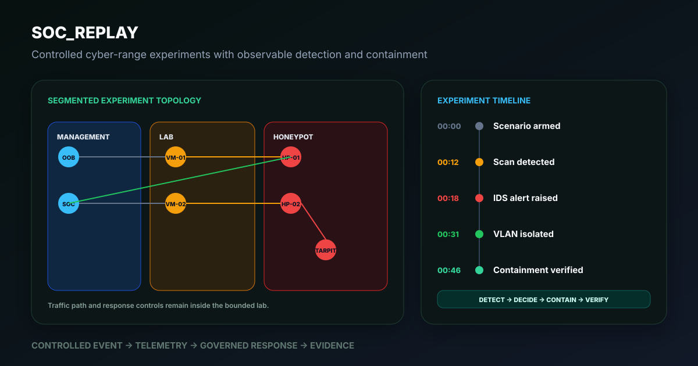
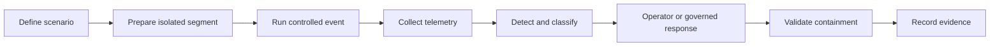

# SOC_Replay

**A controlled cyber-range for replaying security scenarios, observing system behaviour, and evaluating detection and containment procedures across segmented infrastructure.**

*Illustrative scenario view. The topology reflects the repository architecture; the timeline is a demonstration path, not a published measured experiment.*

## The operating problem

A simulated compromised service begins scanning across a lab segment. SOC_Replay provides the isolated infrastructure, telemetry path, detection surface, and operational controls needed to observe the activity, contain it, and preserve evidence without presenting the lab as a production security platform.

## What the operator can decide

| Question | Evidence path |
| --- | --- |
| What happened? | Network, host, IDS/IPS, and centralized logs |
| Where did it move? | Segmented topology and observed traffic path |
| What detected it? | Detection event with supporting telemetry |
| What response was applied? | Operator action or automation record |
| Did containment work? | Post-action validation |
| Can the scenario be repeated? | Environment documentation and runbooks |

## Platform view

SOC_Replay combines segmented networks, physical infrastructure, virtual machines, honeypots, IDS/IPS tooling, centralized logging, dashboards, configuration management, and out-of-band administration in one research environment.

## Experiment lifecycle

## Capability maturity

| Capability | Current state |
| --- | --- |
| Segmented lab networks | Operational platform capability |
| Virtualized experiment environments | Operational platform capability |
| Central logging and monitoring | Operational platform capability |
| Honeypot and deception scenarios | Experiment capability |
| Automated provisioning | Active implementation area |
| Automated containment | Prototype and validation area |
| AI-assisted interpretation | Research area requiring named evidence |
| Predictive maintenance | Roadmap concept |

These states are intentionally distinct. Architecture diagrams do not count as proof that every proposed automation is operational.

## Observability

The purpose of the observability layer is to connect a controlled event to the evidence used for detection, response, validation, and recovery.

## Documentation map

| Area | Documentation |
| --- | --- |
| Architecture | [01 - Architecture](https://github.com/FlorianStuettgen/SOC_Replay/wiki/01-Architecture) |
| Hardware | [02 - Hardware](https://github.com/FlorianStuettgen/SOC_Replay/wiki/02-Hardware) |
| Software stack | [03 - Software Stack](https://github.com/FlorianStuettgen/SOC_Replay/wiki/03-Software-Stack) |
| Network topology | [04 - Network Topology](https://github.com/FlorianStuettgen/SOC_Replay/wiki/04-Network-Topology) |
| Automation | [05 - CI/CD and Automation](https://github.com/FlorianStuettgen/SOC_Replay/wiki/05-CI-CD-Automation) |
| Monitoring | [06 - Monitoring and Telemetry](https://github.com/FlorianStuettgen/SOC_Replay/wiki/06-Monitoring-Telemetry) |
| Security model | [07 - Security Model](https://github.com/FlorianStuettgen/SOC_Replay/wiki/07-Security-Model) |
| Use cases | [08 - Use Cases](https://github.com/FlorianStuettgen/SOC_Replay/wiki/08-Use-Cases) |
| Runbook | [11 - Operations Runbook](https://github.com/FlorianStuettgen/SOC_Replay/wiki/11-Operations-Runbook) |
| Firewall policy | [12 - Firewall Policy Reference](https://github.com/FlorianStuettgen/SOC_Replay/wiki/12-Firewall-Policy-Reference) |
| Experiment method | [13 - Experiment Lifecycle](https://github.com/FlorianStuettgen/SOC_Replay/wiki/13-Experiment-Lifecycle) |

## Evidence standard

Every featured scenario should publish the same sequence:

1. Objective and authorization boundary
2. Initial topology and system state
3. Triggering event
4. Detection signal
5. Supporting telemetry
6. Decision and response
7. Containment validation
8. Recovery action
9. Lessons and limitations

## What this is not

- It is not a production SOC or commercial security appliance.
- It does not prove that every proposed automation is autonomous or validated.
- It is not authorization for uncontrolled penetration testing.
- It does not claim subsecond containment without scenario-specific measurement.

## Status

**Platform state:** operational research lab  
**Content state:** architecture-rich; experiment evidence remains the priority  
**Primary boundary:** controlled cybersecurity research and demonstration

Next evidence priorities are one complete experiment record, measured timestamps, sanitized configuration examples, and explicit operational/prototype labels for every automation.