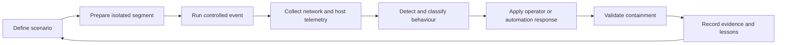
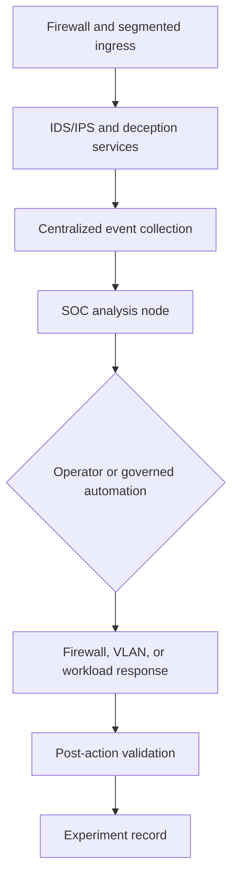
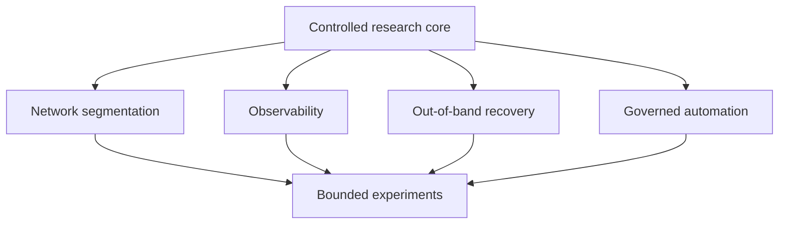

# SOC_Replay

**A controlled cyber-range for replaying security scenarios, observing system behaviour, and evaluating detection and containment procedures across segmented infrastructure.**

A simulated compromised service begins scanning across a lab segment. SOC_Replay provides the isolated infrastructure, telemetry path, detection surface, and operational controls needed to observe the activity, contain it, and record the experiment without presenting the lab as a production security platform.

## What the Operator Can Decide

| Question | SOC_Replay evidence |
| --- | --- |
| What happened? | Network, host, IDS/IPS, and centralized log records |
| Where did it move? | Segmented topology and observed traffic path |
| What detected it? | Detection event and supporting telemetry |
| What response was applied? | Operator action or automation record |
| Did containment work? | Post-action observations and experiment result |
| Can the scenario be repeated? | Documented environment, lifecycle, and runbooks |

## Platform View

SOC_Replay combines segmented networks, physical infrastructure, virtual machines, honeypots, IDS/IPS tooling, centralized logging, dashboards, configuration management, and out-of-band administration in one research environment.

## Capability Maturity

SOC_Replay contains a mixture of operational platform components, validated experiments, active prototypes, and roadmap work. Those states should not be treated as interchangeable.

| Capability | Current presentation | Evidence path |
| --- | --- | --- |
| Segmented lab networks | Operational platform capability | Architecture, topology, and firewall references |
| Virtualized experiment environments | Operational platform capability | Hardware, software stack, and lifecycle documentation |
| Central logging and monitoring | Operational platform capability | Monitoring documentation and dashboard captures |
| Honeypot and deception scenarios | Experiment capability | Use cases and experiment lifecycle |
| Automated provisioning | Active implementation area | CI/CD and automation documentation |
| Automated containment | Prototype and validation area | Scenario-specific response evidence required |
| AI-assisted interpretation | Research area | Must be tied to a named model, input, output, and experiment |
| Predictive maintenance | Roadmap concept | Not presented as established production capability |

## Security and Observability Path

The observability layer brings together infrastructure metrics, network telemetry, event logs, and IDS/IPS findings. The purpose is not merely to display dashboards; it is to connect a controlled event to the evidence used for detection and response.

## What This Is

- A personally operated cybersecurity research lab.
- A segmented environment for controlled experiments and demonstrations.
- A platform for studying detection, observability, containment, orchestration, and recovery.
- A documentation and operations exercise spanning physical and virtual infrastructure.

## What This Is Not

- A production SOC or commercial security appliance.
- Evidence that every proposed automation is currently autonomous or validated.
- A substitute for formal penetration-testing authorization or safe research boundaries.
- A claim that diagrams alone prove operational behaviour.
- A guarantee of subsecond containment without scenario-specific measurement.

## Architecture Principles

- Isolate experiments before increasing automation.
- Preserve out-of-band access and recovery paths.
- Treat logs and measurements as evidence, not decoration.
- Distinguish implemented, validated, prototype, and planned capabilities.
- Keep human authority visible wherever automation can alter network state.
- Document the experiment lifecycle so results can be repeated and challenged.

## Documentation Map

| Area | Documentation |
| --- | --- |
| System structure | [01 - Architecture](https://github.com/FlorianStuettgen/SOC_Replay/wiki/01-Architecture) |
| Physical platform | [02 - Hardware](https://github.com/FlorianStuettgen/SOC_Replay/wiki/02-Hardware) |
| Operating stack | [03 - Software Stack](https://github.com/FlorianStuettgen/SOC_Replay/wiki/03-Software-Stack) |
| Segmentation and flow | [04 - Network Topology](https://github.com/FlorianStuettgen/SOC_Replay/wiki/04-Network-Topology) |
| Provisioning and orchestration | [05 - CI/CD and Automation](https://github.com/FlorianStuettgen/SOC_Replay/wiki/05-CI-CD-Automation) |
| Monitoring evidence | [06 - Monitoring and Telemetry](https://github.com/FlorianStuettgen/SOC_Replay/wiki/06-Monitoring-Telemetry) |
| Trust and control model | [07 - Security Model](https://github.com/FlorianStuettgen/SOC_Replay/wiki/07-Security-Model) |
| Scenario catalogue | [08 - Use Cases](https://github.com/FlorianStuettgen/SOC_Replay/wiki/08-Use-Cases) |
| Current and future work | [09 - Roadmap](https://github.com/FlorianStuettgen/SOC_Replay/wiki/09-Roadmap) |
| Reference material | [10 - Appendix](https://github.com/FlorianStuettgen/SOC_Replay/wiki/10-Appendix) |
| Operating procedures | [11 - Operations Runbook](https://github.com/FlorianStuettgen/SOC_Replay/wiki/11-Operations-Runbook) |
| Network enforcement reference | [12 - Firewall Policy Reference](https://github.com/FlorianStuettgen/SOC_Replay/wiki/12-Firewall-Policy-Reference) |
| Repeatable experiment method | [13 - Experiment Lifecycle](https://github.com/FlorianStuettgen/SOC_Replay/wiki/13-Experiment-Lifecycle) |

## Recommended Experiment Record

Every featured scenario should eventually publish the same evidence sequence:

1. Objective and authorization boundary
2. Initial topology and system state
3. Triggering event
4. Detection signal
5. Supporting telemetry
6. Operator or automation decision
7. Containment action
8. Validation result
9. Recovery action
10. Lessons, limitations, and next test

This is the primary content direction for the repository: fewer generalized capability claims, more named and repeatable experiments.

## Current Status

**Platform state:** operational research lab  
**Content state:** architecture-rich; experiment evidence is the next priority  
**Primary boundary:** controlled cybersecurity research and demonstration

Next evidence priorities:

- publish one complete end-to-end experiment record;
- attach measured timestamps to detection and containment claims;
- expose sanitized configuration examples where safe;
- connect dashboard images to named scenarios and source events;
- label each automation as operational, validated, prototype, or planned; and
- add recovery evidence showing how failed experiments return to a known state.

