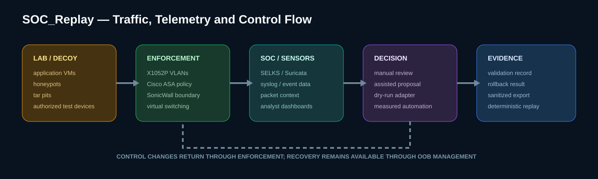

# 01 — Architecture

## Purpose

SOC_Replay is a self-hosted cyber range and SOC experimentation platform built from enterprise compute, storage, networking, security and console-management hardware. It exists to provide a segmented, observable and recoverable environment for controlled defensive research.

The architecture is not a single application. It is a system of physical and virtual layers whose value comes from their interaction.

## Architectural layers

### 1. Physical platform

- **Dell PowerEdge R710:** primary secure compute host running Qubes OS.
- **Dual EqualLogic FS7610 controllers and Avid storage chassis:** storage-backed services and secondary virtualization through Proxmox VE.
- **Dell X1052P:** managed core switch providing VLAN trunks and segmented paths.
- **Cisco ASA 5510 and ASA 5515-X:** policy-enforcement and firewall research platforms.
- **SonicWall SRA 4200:** secure remote-access and boundary experimentation appliance.
- **Panasonic Toughbook:** dedicated SELKS/Suricata SOC and network-analysis node.
- **OpenGear CM4148, StarTech KVM and HP TFT5600:** out-of-band and local-console recovery paths.

### 2. Virtualization and workload plane

Qubes OS provides compartmentalized management and experiment domains on the R710. Proxmox VE supports storage-centric services and additional VM/container workloads on the EqualLogic/Avid platform. The architecture allows experiments to be isolated from management and recovery functions.

### 3. Trust-zone and enforcement plane

The network model combines workload VLANs with broader trust zones:

- VLAN 10 — application and lab VMs
- VLAN 20 — honeypot workloads
- VLAN 30 — tar-pit workloads
- Management — privileged administration and OOB access
- Core — switch, storage and critical services
- DMZ — boundary-facing services
- Guest — temporary and untrusted access

The switch, firewalls and virtual switching layers enforce or model the boundaries. See [Network Topology](04-Network-Topology.md).

### 4. Telemetry and SOC plane

Traffic, security events and infrastructure data flow toward the dedicated SOC node. SELKS and Suricata provide network detection and analyst visibility. The documented stack also includes centralized logging and dashboard integrations; their maturity is tracked separately from the installed SOC node.

### 5. Orchestration plane

The repository historically describes SaltStack/LLM-assisted orchestration for VM placement, VLAN changes, honeypot activation and policy response. That remains an architectural direction and prototype track. No general autonomous-containment claim should be made without a named experiment, measured timing, approval boundary and rollback evidence.

### 6. Evidence replay plane

The Python utility under `src/soc_replay/` evaluates stored synthetic or sanitized telemetry. It provides deterministic rule validation and report generation. It does not operate the physical lab and has no live-response connector.

## Primary flows

| Flow | Purpose |
| --- | --- |
| Compute → storage | VM images, snapshots, service data and recovery material |
| Workloads → core switch | VLAN-segmented application and experiment traffic |
| Honeypot/tar pit → SOC | Defensive observation and event collection |
| Firewall → SOC | Policy, IDS/IPS and boundary-event evidence |
| OOB → hardware | Independent console access during failure or isolation |
| SOC → analyst/orchestrator | Detection context and proposed response |
| Sanitized telemetry → replay engine | Repeatable evidence evaluation outside the live platform |

## Design principles

### Segmentation before automation

Management, core, lab, DMZ, guest and honeypot functions remain separate. Automation may reduce response time, but it cannot substitute for sound trust boundaries.

### Recovery outside the experiment path

OpenGear and KVM access remain independent of normal workload networking. A failed firewall rule, VLAN change or hypervisor experiment must not remove the ability to recover the platform.

### Observability as evidence

Dashboards and diagrams are navigation aids. Behavioural claims require source events, timestamps, rule logic, response records and validation results.

### Explicit maturity

Installed hardware, configured services, prototypes and roadmap items are not interchangeable. The controlling register is [Implementation State](14-Implementation-State.md).

## Relationship to historical documentation

The original wiki correctly positioned SOC_Replay as an enterprise-style lab built around modular trust zones, dynamic orchestration and layered monitoring. This file-based architecture preserves that intent while tightening unsupported claims and linking each layer to evidence in the repository.
