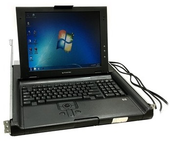
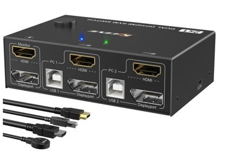
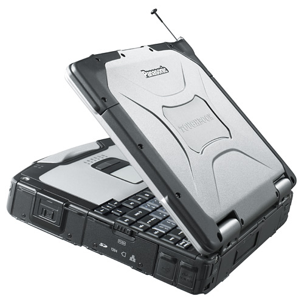
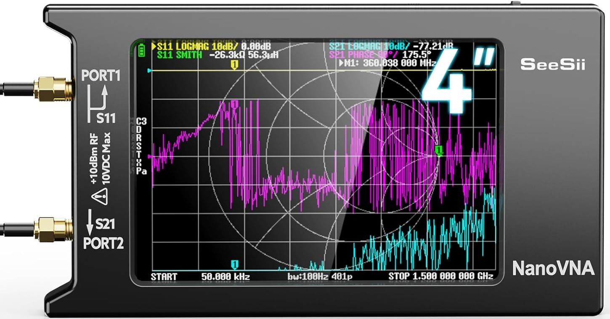

# 02 — Hardware inventory

SOC_Replay is grounded in a physical rack. This page records the equipment that gives the project its enterprise character and recovery options.

## Rack inventory

| Component | Role | Documented configuration or function | Evidence |
| --- | --- | --- | --- |
| HP Compaq TFT5600 | Rack console drawer | Local display, keyboard and pointing device | Rack photography |
| UltraPoE switched PDU | Power distribution | Individually switched outlets for lab components | Rack photography |
| StarTech SV411USB | KVM switching | Four-port VGA/USB console switching | Console photography |
| Cisco ASA 5510 | Firewall platform | Classic ASA policy and segmentation research | [Photo](../assets/photos/Cisco%20ASA%205510.jpg) |
| Cisco ASA 5515-X | Firewall platform | Higher-capacity ASA and IPS-oriented experimentation | [Photo](../assets/photos/Cisco%20ASA%205515-x.jpg) |
| SonicWall SRA 4200 | Secure remote access | Remote-access and boundary-control experimentation | [Photo](../assets/photos/SonicWall%20SRA%204200.jpg) |
| Dell X1052P | Core managed switch | 48-port Gigabit L2/L3 switching, PoE and VLAN trunks | [Photo](../assets/photos/Dell%20X1052P.jpg) |
| OpenGear CM4148 | Out-of-band console manager | Serial-over-network access to rack devices | [Photo](../assets/photos/OpenGear%20CM4148.jpg) |
| Dell PowerEdge R710 | Primary compute host | Dual Xeon platform, 96–128 GB documented RAM range, Qubes OS role | [Photo](../assets/photos/R710.jpg) |
| Dual EqualLogic FS7610 | Storage controllers | iSCSI-backed storage and multi-LUN services | [Photo](../assets/photos/EqualLogic.png) |
| Avid 18-bay chassis | Storage enclosure | Storage capacity paired with the EqualLogic/Proxmox layer | [Photo](../assets/photos/Avid%20Bay.png) |
| Panasonic Toughbook | SOC node | SELKS and Suricata monitoring/analysis console | Monitoring photography |
| Patch panels and short patch leads | Cabling | Organized front/back network presentation | [Photo](../assets/photos/patch.jpg) |

## Platform roles

### Qubes compute

The R710 is the principal compartmentalized compute platform. Qubes OS separates management, lab and specialized workloads into security domains rather than treating every VM as equally trusted.

### Storage and secondary virtualization

The EqualLogic/Avid layer supplies storage-backed workloads and recovery capacity. Proxmox VE is documented as the service and storage-oriented virtualization layer associated with this platform.

### Network security

The X1052P carries the segmented network. Cisco ASA appliances and the SonicWall platform provide distinct generations and styles of boundary control for policy, logging and remote-access research.

### SOC and recovery

The Toughbook provides a dedicated analyst surface. OpenGear, KVM and the rack console preserve management access when ordinary network paths are unavailable.

## Photo gallery

<table>
<tr>
<td></td>
<td></td>
</tr>
<tr>
<td align="center">Rack overview</td>
<td align="center">Console and management view</td>
</tr>
<tr>
<td></td>
<td></td>
</tr>
<tr>
<td align="center">OOB/local console path</td>
<td align="center">SOC monitoring capture</td>
</tr>
<tr>
<td></td>
<td></td>
</tr>
<tr>
<td align="center">Telemetry/analysis view</td>
<td align="center">Storage enclosure</td>
</tr>
</table>

## Inventory-control notes

Public documentation should record model, role, operating state and firmware family without publishing serial numbers, credentials, management addresses or recovery secrets. A private inventory can retain those values separately.

The hardware photographs prove possession and integration. They do not by themselves prove every software role or automation path; those are tracked in [Implementation State](14-Implementation-State.md).
