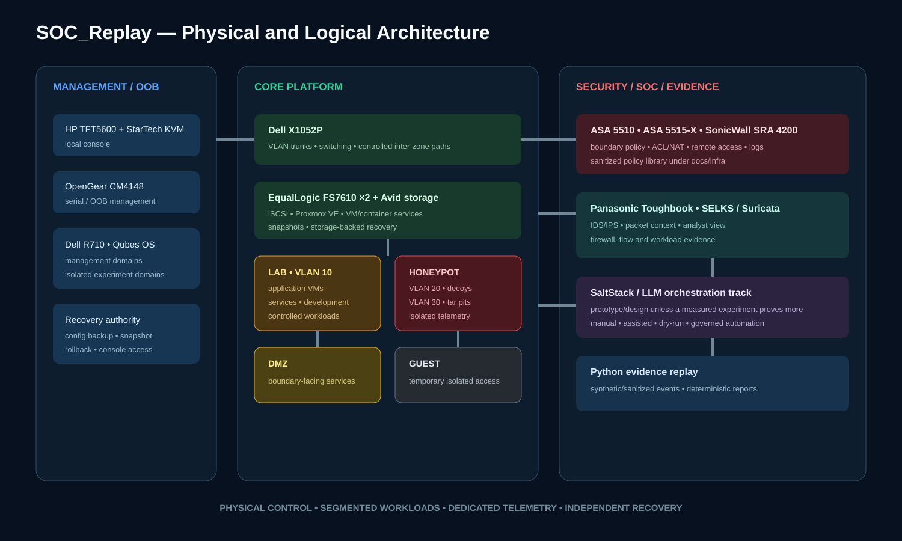

# 04 — Network topology

SOC_Replay uses a segmented, zero-trust-inspired topology that separates privileged administration, critical infrastructure, ordinary lab workloads, exposed services and decoy systems.

## Workload VLANs

| VLAN | Historical assignment | Zone | Purpose |
| --- | --- | --- | --- |
| 10 | Application and service VMs | Lab | Controlled workloads, development and service testing |
| 20 | Honeypot VMs | Honeypot | Decoy services and defensive observation |
| 30 | Tar-pit VMs | Honeypot | Delayed interaction and additional telemetry |

These identifiers are the documented lab mapping. Actual switch/firewall configuration should be checked against the current sanitized export before a change is made.

## Trust zones

| Zone | Colour | Assets and responsibilities |
| --- | --- | --- |
| Management | Blue | Administrative domains, OpenGear, KVM and privileged access |
| Core | Green | X1052P, storage, routing and critical services |
| DMZ | Yellow | Boundary-facing services with restricted paths |
| Lab | Orange | Application VMs, development and experiments |
| Honeypot | Red | Honeypots, tar pits and adversary-observation workloads |
| Guest | Black | Temporary and isolated access |

## Enforcement points

- **Dell X1052P:** VLAN trunks and L2/L3 segmentation.
- **Cisco ASA platforms:** firewall policy, ACL, NAT and logging research.
- **SonicWall platform:** remote-access and DPI-oriented boundary experiments.
- **Qubes/Proxmox virtual networking:** hypervisor-side workload separation.
- **OpenGear/KVM:** independent management when the normal data path is unavailable.

## Documented traffic paths

| Source | Destination | Reason |
| --- | --- | --- |
| Workload VMs | Core switch | Segmented application and experiment traffic |
| Honeypot/tar-pit workloads | SOC node | Mirrored or logged defensive observation |
| Core switch | Firewall layer | Boundary inspection and policy enforcement |
| Firewall layer | SOC/logging | Alerts, policy events and audit evidence |
| Compute | storage | VM data, snapshots and service storage |
| OOB management | physical devices | Recovery and maintenance independent of workload VLANs |

## Orchestration path

The historical architecture includes an orchestration plane capable of proposing or applying VLAN changes, workload isolation and decoy activation. The public repository treats this as a prototype/design capability unless a named experiment publishes:

1. initial topology;
2. triggering evidence;
3. decision logic;
4. exact change;
5. approval mode;
6. measured completion time;
7. post-change validation; and
8. rollback result.

## Firewall policy library

The restored files under [`infra/lab-firewall-policies/`](infra/lab-firewall-policies/) cover management access, interface segmentation, NAT, ACLs, VPN, IDS/IPS, logging, hardening and change control. They are sanitized baselines and must be adapted to the actual environment; placeholder zone/VLAN examples inside those documents do not supersede this topology page.
