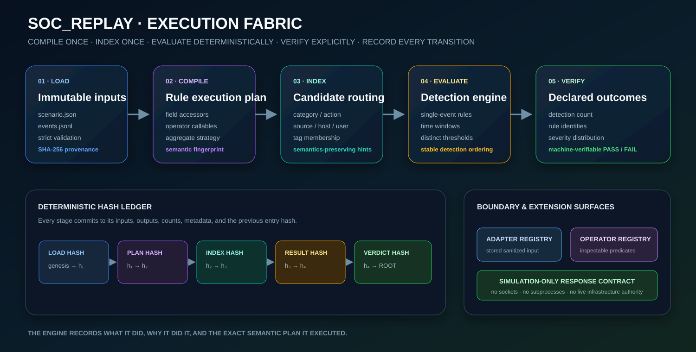

# 22 — Execution Core



## Purpose

The execution core converts immutable scenario inputs into a deterministic, reviewable decision trail. The design favors explicit state transitions over hidden orchestration.

## Stage 1: Load

The loader validates the scenario contract, parses JSONL incrementally, rejects duplicate IDs, sorts events deterministically, applies the event limit, and hashes both source files.

Output identity:

```text
run_id = SHA-256(schema_version : scenario_hash : events_hash)[0:16]
```

## Stage 2: Compile

Each rule becomes a `CompiledRule` containing:

- pre-parsed field accessors;
- bound operator functions;
- compiled grouping and distinct-value accessors;
- a candidate-index hint; and
- a semantic fingerprint.

The plan fingerprint commits to the scenario ID, schema version, and ordered rule fingerprints.

## Stage 3: Index

The engine builds immutable indexes for:

- category;
- action;
- outcome;
- source;
- host;
- user; and
- tags.

The index returns a candidate set and a human-readable strategy. Full rule conditions remain authoritative.

## Stage 4: Evaluate

Single-event rules emit one detection per matched event. Aggregate rules use a sliding window inside deterministic groups. Detection metadata records candidate strategy, candidate and match counts, correlation thresholds, and rule fingerprint.

## Stage 5: Verify

The verifier compares the ordered result with declared expectations:

- detection count;
- rule IDs;
- severity distribution; and
- simulated action count.

A scenario can therefore serve as an executable regression contract.

## Invariants

1. Inputs are immutable after loading.
2. Rules are compiled before evaluation.
3. Indexes cannot alter rule semantics.
4. Responses remain simulation-only.
5. Every stage is represented in the execution ledger.
6. Equivalent input bytes and engine version produce equivalent report bytes.
